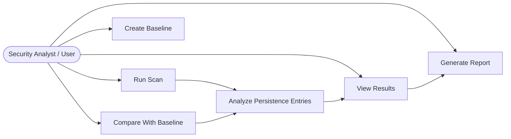

# Windows-Autorun-Inspector
## Problem Statement

Windows provides several auto-start mechanisms such as Startup folders, Registry Run keys, Scheduled Tasks, and Services. While these mechanisms are useful for legitimate software, they can also be abused by malware to maintain persistence after reboot or user login.

Manually checking these locations is slow and can be difficult for students, analysts, or incident responders. It is also easy to miss suspicious entries, especially when they are hidden among many normal applications.

Windows autorun inspector solves this problem by automatically scanning common Windows persistence locations, comparing the current system state with a trusted baseline, applying suspicious-pattern rules, calculating risk scores, and generating reports that help users identify possible persistence activity.

## Features

- Automatic scan of common Windows persistence locations
- Startup folder inspection
- Registry Run and RunOnce key inspection
- Registry timestamp analysis for detecting recently modified autorun keys
- Scheduled Tasks inspection
- Windows Services inspection
- Baseline creation and comparison
- Detection of new, removed, or modified autorun entries
- Suspicious path and command analysis
- Risk scoring for each finding
- JSON, CSV, and HTML report generation
- MITRE ATT&CK technique mapping
- Defensive-only detection and reporting

## Tech Stack

| Part | Technology |
|---|---|
| Language | Python |
| First Interface | CLI |
| Future Interface | PySide6 Desktop GUI |
| Registry Scanner | winreg |
| System Commands | PowerShell + subprocess |
| File Scanning | pathlib / os |
| Baseline Storage | JSON |
| Reports | JSON, CSV, HTML |
| CLI Framework | Typer |
| Terminal UI | Rich |
| HTML Templates | Jinja2 |
| Testing | pytest |
| Version Control | Git + GitHub |

# Project Structure

```text
Windows autorun inspector/
│
├── app/
│   ├── main.py
│   │
│   ├── core/
│   │   └── engine.py
│   │
│   ├── cli/
│   │   └── commands.py
│   │
│   ├── gui/
│   │   ├── main_window.py
│   │   ├── results_table.py
│   │   └── details_panel.py
│   │
│   ├── collectors/
│   │   ├── startup_collector.py
│   │   ├── registry_collector.py
│   │   ├── tasks_collector.py
│   │   └── services_collector.py
│   │
│   ├── analysis/
│   │   ├── normalizer.py
│   │   ├── risk_engine.py
│   │   ├── baseline_compare.py
│   │   └── rules.py
│   │
│   ├── reports/
│   │   ├── json_report.py
│   │   ├── csv_report.py
│   │   └── html_report.py
│   │
│   ├── storage/
│   │   ├── baseline_store.py
│   │   └── history_store.py
│   │
│   └── utils/
│       ├── powershell_runner.py
│       ├── hash_utils.py
│       └── time_utils.py
│
├── tests/
├── docs/
├── reports/
├── README.md
├── requirements.txt
├── .gitignore
└── LICENSE

```
```markdown
## Application Workflow

1. The user runs a command such as `winpersist scan`.
2. The CLI sends the request to the Core Engine.
3. The Core Engine starts the collectors.
4. Collectors inspect Startup folders, Registry Run keys, Scheduled Tasks, and Windows Services.
5. The Normalizer converts all collected entries into a common format.
6. The Risk Engine applies suspicious-pattern rules and calculates risk scores.
7. The Baseline Comparator checks for new, removed, or modified entries.
8. Findings are classified as Low, Medium, High, or Critical.
9. The Report Generator exports JSON, CSV, or HTML reports.
10. The user reviews the final summary and detailed report.

## Use Case Diagram

The use case diagram shows the main actions that the user can perform with **WinPersist Hunter**.  
The user can run a scan, create a trusted baseline, compare the current system state with the baseline, view detected results, and generate a report.

