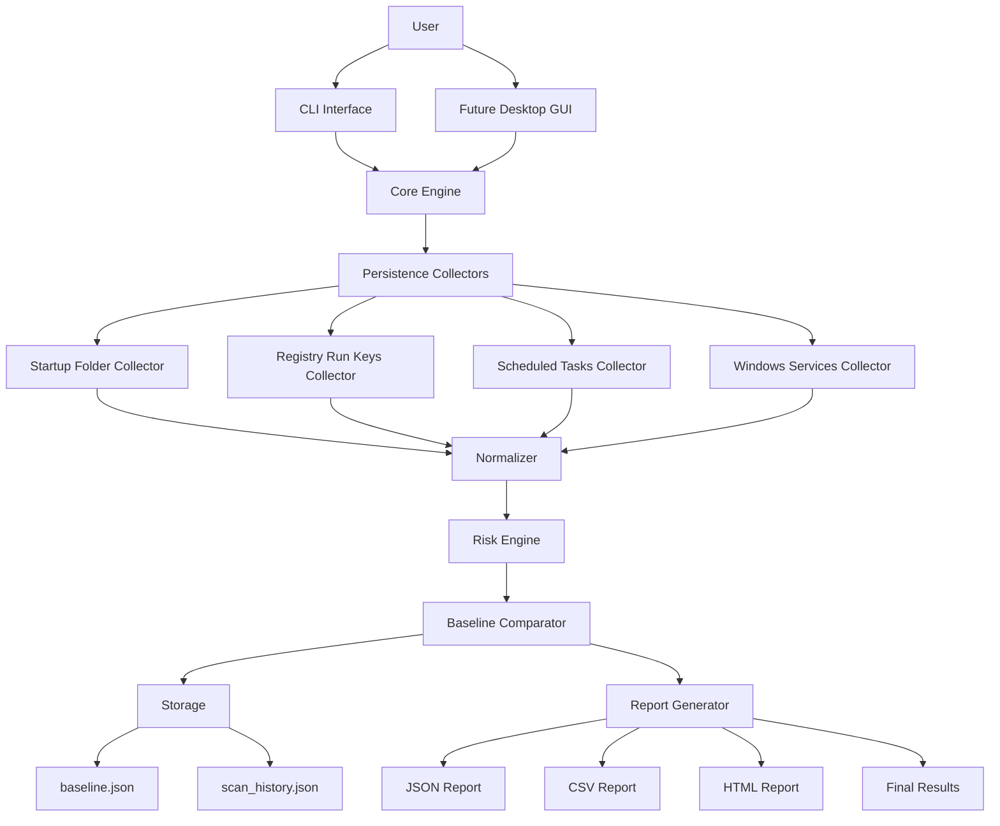

# Architecture

```mermaid

flowchart TD
    A[User] --> B[CLI Interface]
    A --> C[Future Desktop GUI]

    B --> D[Core Engine]
    C --> D

    D --> E[Persistence Collectors]

    E --> E1[Startup Folder Collector]
    E --> E2[Registry Run Keys Collector]
    E --> E3[Scheduled Tasks Collector]
    E --> E4[Windows Services Collector]

    E1 --> F[Normalizer]
    E2 --> F
    E3 --> F
    E4 --> F

    F --> G[Risk Engine]
    G --> H[Baseline Comparator]

    H --> I[Storage]
    I --> I1[baseline.json]
    I --> I2[scan_history.json]

    H --> J[Report Generator]
    J --> J1[JSON Report]
    J --> J2[CSV Report]
    J --> J3[HTML Report]

    J --> K[Final Results]

```