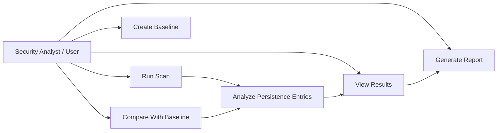

# Use Case Diagram

The use case diagram shows the main actions that the user can perform with **WinPersist Hunter**.

## Explanation

- **Run Scan:** Inspect Windows persistence locations.
- **Create Baseline:** Save the current clean system state.
- **Compare With Baseline:** Detect new, removed, or modified entries.
- **View Results:** Show detected entries and risk levels.
- **Generate Report:** Export the final analysis report.